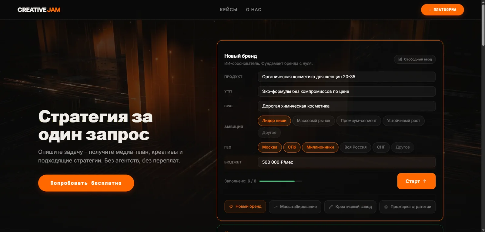
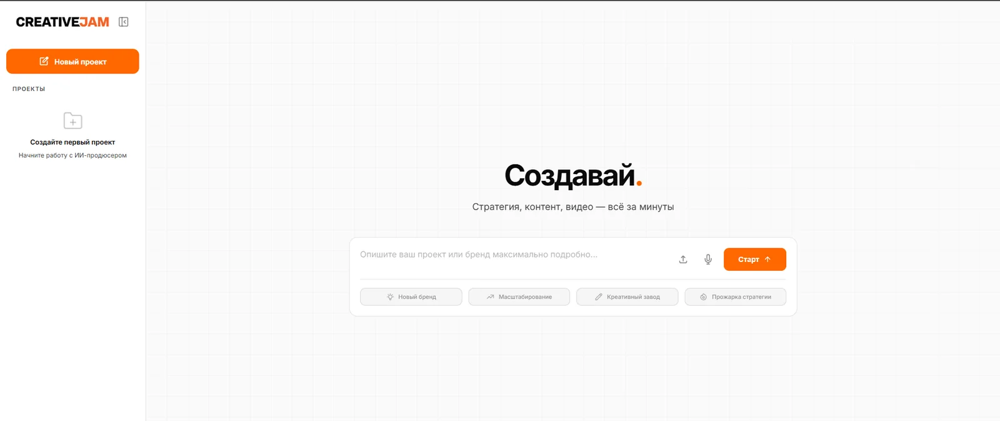
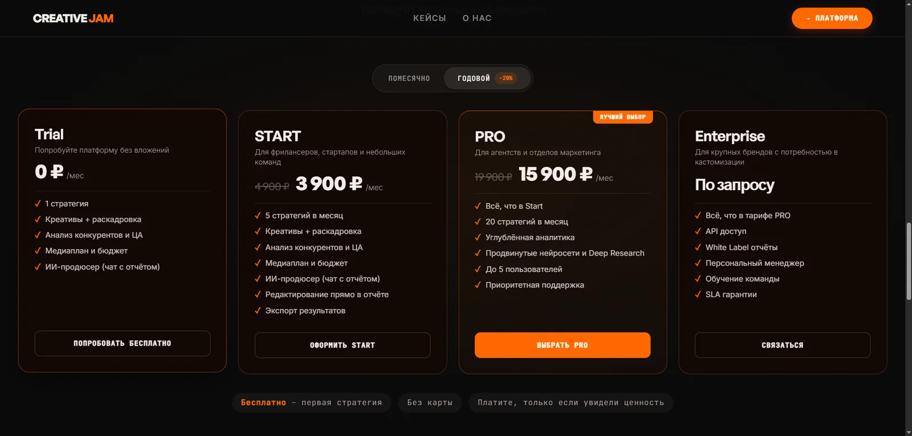

# Creative Jam

AI-assisted product for turning a brief into a structured research-driven report.

**Live demo:** https://huggingface.co/spaces/Ostvald/creative-jam

## What is public here

- `landing/` — product landing
- `frontend/` — application interface
- `docs/` — screenshots and public project notes

The current **backend, AI pipeline, database and payment implementation are private**.

## Product

| App | Pricing |
| --- | --- |
|  |  |

## My role

**Co-founder · AI-assisted Full-stack Developer**

Frontend/backend implementation, database setup, payment integration, AI report-generation pipeline, refactoring and validation of AI-generated code.

## Stack

`JavaScript` · `HTML/CSS` · `Node.js` · `PostgreSQL` · `Supabase` · `Drizzle ORM` · `LLM APIs`

## Status

Active development. Tested by real users and currently running as a Docker Space on Hugging Face.

---

Built by **Tim Ostvald** and **Zakhar Kondratiev**.
